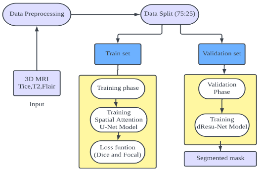
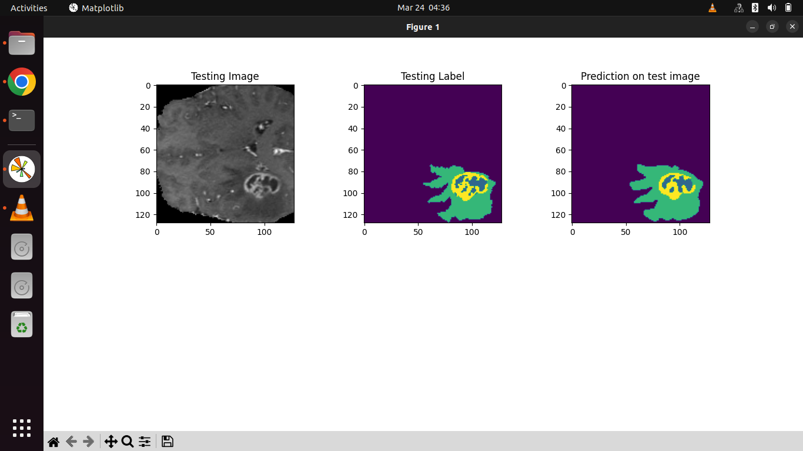

# Brain Tumor Segmentation

3D brain tumor segmentation on the BraTS benchmark using Keras/TensorFlow. This repository includes preprocessing, training, and evaluation scripts, along with three 3D U-Net variants: a baseline model, an improved (deeper) U-Net, and a U-Net with channel-wise spatial attention.

## Overview

The pipeline loads multi-modal MRI volumes (FLAIR, T1ce, T2), preprocesses and crops them to 128×128×128 patches, trains a 3D segmentation model, and evaluates predictions with IoU metrics and slice visualizations.

**Training setup:** Adam optimizer (LR = 0.0001), ReLU + batch normalization, Dice + focal loss, 100 epochs, batch size 2 (GPU memory limited).

**Datasets:**
- **Training/validation:** BraTS 2020 — 75% train / 25% validation
- **Testing:** BraTS 2021 — evaluated on a held-out subset (batch size 6–8)

## Pipeline



*Input: 3D MRI (T1ce, T2, FLAIR) → preprocessing → 75/25 train/val split → Spatial Attention U-Net training with Dice + Focal loss → segmented mask output.*

```
Raw NIfTI (BraTS) → get_ready.py → .npy patches (128³)
                                        ↓
                              train.py / modtrain.py
                                        ↓
                              Saved model (.hdf5)
                                        ↓
                                   test.py → IoU + plots
```

## Project Structure

```
Brain-Tumor-Segmentation/
├── get_ready.py              # Preprocess raw NIfTI data and split train/val
├── train.py                  # Train baseline 3D U-Net → brats_3d.hdf5
├── modtrain.py               # Train improved 3D U-Net → modified_brats_3d.hdf5
├── test.py                   # Load saved model, compute IoU, plot predictions
├── custom_datagen.py         # Batch data loader for .npy volumes
├── simple_unet/
│   └── simple_3dunet.py      # Baseline 3D U-Net
├── modified_unet/
│   └── modified_3dunet.py    # Improved 3D U-Net (deeper, dropout)
└── spatial_attenstion_unet/
    └── spatial_attension_model.py  # U-Net with channel attention
```

## Models

| Model | File | Training script | Output weights |
|-------|------|-----------------|----------------|
| Baseline 3D U-Net | `simple_unet/simple_3dunet.py` | `train.py` | `brats_3d.hdf5` |
| Improved 3D U-Net | `modified_unet/modified_3dunet.py` | `modtrain.py` | `modified_brats_3d.hdf5` |
| Attention U-Net | `spatial_attenstion_unet/spatial_attension_model.py` | — | — |

The attention variant (`improved_unet_model_with_attention`) adds channel-wise attention blocks to the encoder–decoder path. Wire it into a training script by importing it the same way as the other models.

### Channel Attention Module


*Average pooling and max pooling are combined, passed through a convolution + softmax, and multiplied back onto the feature maps to produce attended feature maps.*

## Requirements

- Python 3.8+
- NVIDIA GPU with CUDA (recommended for 3D volumes)
- TensorFlow 2.x with Keras

```bash
pip install tensorflow numpy nibabel scikit-learn matplotlib pandas tifffile split-folders segmentation-models-3D ipynb
```

## Dataset Setup

1. Download the [BraTS 2020 training data](https://www.synapse.org/#!Synapse:syn27046444) and place it under:

```
BraTS2020_TrainingData/MICCAI_BraTS2020_TrainingData/
└── BraTS20_Training_XXX/
    ├── BraTS20_Training_XXX_flair.nii
    ├── BraTS20_Training_XXX_t1ce.nii
    ├── BraTS20_Training_XXX_t2.nii
    └── BraTS20_Training_XXX_seg.nii
```

2. For BraTS 2021 evaluation, download the [BraTS 2021 data](https://www.synapse.org/#!Synapse:syn27046444) and preprocess it using the same steps in `get_ready.py` (adjust paths as needed).

## Usage

### 1. Preprocess data

```bash
python get_ready.py
```

This script:
- Loads FLAIR, T1ce, T2, and segmentation masks from NIfTI files
- Normalizes intensities with MinMax scaling
- Crops volumes to 128×128×128
- Filters out samples with less than 1% labeled tumor voxels
- Saves `.npy` files and splits them 75/25 into train/validation under `BraTS2020_TrainingData/input_data_128/`

### 2. Train a model

**Baseline U-Net:**

```bash
python train.py
```

**Improved U-Net:**

```bash
python modtrain.py
```

Both scripts use Dice + categorical focal loss, Adam (LR = 0.0001), and save weights when training completes.

> **Note:** `train.py` and `modtrain.py` import models via `ipynb.fs.full.*` (Jupyter notebook export convention). Ensure the `ipynb` package is installed, or change the imports to:
> ```python
> from simple_unet.simple_3dunet import simple_unet_model
> from modified_unet.modified_3dunet import improved_unet_model
> ```

### 3. Evaluate

```bash
python test.py
```

Loads `modified_brats_3d.hdf5` by default, computes mean IoU on a validation batch, and plots a sample slice (input, ground truth, prediction).

## Training Progress

Training in progress (Spatial Attention U-Net, epoch 1/10):


Loss and accuracy curves over 100 epochs:


Loss curve at the end of improved U-Net training (epoch 100):


Loss curve at the end of spatial attention U-Net training (epoch 100):


## Results

### Quantitative Metrics

| Model | Mean IoU | Val Accuracy | Val IoU | Notes |
|-------|----------|--------------|---------|-------|
| Baseline 3D U-Net | — | — | — | Trained on BraTS 2020 |
| Improved 3D U-Net | — | 0.9774 | 0.6675 | 100 epochs, BraTS 2020 |
| Spatial Attention U-Net | ~0.779 | 0.9818 | 0.6773 | 100 epochs, BraTS 2020 |


### Qualitative Predictions

Side-by-side comparison of input MRI slice, ground-truth label, and model prediction.

**Baseline 3D U-Net:**



**Improved 3D U-Net:**


**Spatial Attention U-Net:**


**Sample evaluation from `test.py`:**


## Implementation Details

- **Framework:** Python, Keras, TensorFlow
- **Input:** 128×128×128 volumes, 3 channels (FLAIR, T1ce, T2)
- **Output:** 4-class softmax segmentation (background + 3 tumor regions)
- **Loss:** Dice loss + categorical focal loss (equal class weights)
- **Metrics:** Accuracy, IoU score (threshold 0.5)
- **Optimizer:** Adam, learning rate 0.0001
- **Regularization:** Batch normalization, dropout (0.2–0.5 in improved model)
- **Training:** 100 epochs, batch size 2
- **Split:** 75% training / 25% validation on BraTS 2020

## References

- [BraTS Challenge](https://www.synapse.org/brats)
- Menze et al., "The Multimodal Brain Tumor Image Segmentation Benchmark (BRATS)", IEEE TMI, 2015.
